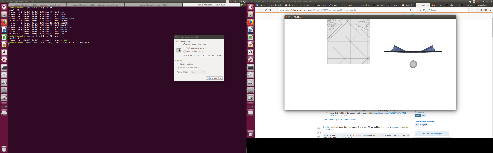

# ARCSim-Installation-Instructions

You can find ARCSim here: http://graphics.berkeley.edu/resources/ARCSim/


## ARCSim 0.3.1 on Ubuntu 16.04

Here are the steps I followed for version 0.3.1 (with the fractures) on an
Ubuntu 16.04 system. First, unzip the `tar.gz` file somewhere and read the
INSTALL file. You'll see that they tell you to install some libraries, but it's
not clear what the precise commands should be (and there are some missing
instructions). Here's what I did:

- Rename `Makefile.linux` to `Makefile` if using Ubuntu/Linux, because it seems
  like OS X is the default. Of course, if you're on OS X then you're probably
  OK (but it might be good to rename `Makefile.mac` to `Makefile` anyway).

- Install the following via `sudo apt-get install`:

  ```
  sudo apt-get install gcc make g++ libboost-all-dev freeglut3-dev \
            gfortran liblapacke-dev libpng-dev libpng++-dev scons \
            libatlas-base-dev ctags libopenblas-dev
  ```

  For OS X, you'll need to figure out how to get the equivalent libraries
  installed on your own.

- Delete a directory: `rm -r dependencies/taucs/build/darwin/`.

- If you are running Python 3, [follow these instructions](installation-with-python-3.x).

- Change directory into `dependencies/` and run `make`. If you didn't delete
  the directory in the previous step, you'll get this error at the end of a
  LONG print out:

  ```
  -llapack -L/usr/lib64/atlas -L/usr/lib64/atlas-sse3 -lf77blas -lcblas -latlas -lgfortran -lm
  make[1]: Leaving directory '/home/daniel/arcsim-0.3.1/dependencies/taucs'
  mkdir -p include/ lib/
  cp taucs/build/*/*.h taucs/src/*.h include/
  cp: will not overwrite just-created 'include/taucs_config_build.h' with 'taucs/build/linux/taucs_config_build.h'
  Makefile:18: recipe for target 'lib/libtaucs.a' failed
  make: *** [lib/libtaucs.a] Error 1
  ```

  But anyway, hopefully running `make` works. Ideally you should see this after
  doing `make` a second time:

  ```
  daniel@takeshi:~/arcsim-0.3.1/dependencies $ make
  make: Nothing to be done for 'all'.
  daniel@takeshi:~/arcsim-0.3.1/dependencies $
  ```

- Now go back into the top-level directory `arcsim-0.3.1/` and type `make`. If
  it runs without errors, that's a good sign! Immediately running `make` a
  second time gives me this:

  ```
  daniel@takeshi:~/arcsim-0.3.1 $ make
  cd src; ctags -w *.?pp
  cd src; etags *.?pp
  ```

  which seems to be harmless.


To test the installation, run

```
./bin/arcsim simulate conf/sphere.json
```

I see this so hopefully things are OK:


I am not yet sure about the details of this setup, but that should be a matter
of reading their code.


Note: after doing `make` in the `dependencies/` directory, but *before* doing
`make` for the `arcsim-0.3.1` directory, you might need to make the following
fixes if they are resulting in compilation errors:

- Change `<< file` to `<< std::endl` at the end of line 118 of `src/sparse.hpp`.

- Comment out lines 805 and 811 in `dependencies/include/taucs.h`, which are:

  ```
  [805] extern int isnan(double);
  [811] extern int isinf(double);
  ```

But I did not need to do those and it seems like things are working on my end.
To test, we can read through the code and run commands, while running `make`
each time to compile. We shouldn't have to re-compile the dependencies, though.

### Installation with Python 3.x
If your machine does not have Python 2.x installed (e.g. Ubuntu 20.04 by default), you may run into this issue:

```
scons: Reading SConscript files ...
  File "/home/fedebotu/Downloads/add0n.com/arcsim-0.3.1/dependencies/jsoncpp/SConstruct", line 31
    print "Using platform '%s'" %platform
          ^
SyntaxError: Missing parentheses in call to 'print'. Did you mean print("Using platform '%s'" %platform)?
make: *** [Makefile:12: lib/libjson.a] Error 2
```
This is caused by the old syntax and deprecated functions in Python 2. In particular, you can fix the error by modifying the code in the `SConstruct` file to work with the newer version. 
1. Install `apply` ( i.e., with `pip install apply` )
2. Download the modified [SConstruct](SConstruct) file from this repository and replace the old one in `dependencies/jsoncpp/SCOnstruct`


## ARCSim 0.2.1 on Ubuntu 16.04


- You do not need to rename the Makefile (as in 0.3.1) because there is only
  one Makefile.

- Install the same packages as for 0.3.1 using the same `sudo apt-get install [...]` command.

- Go to `dependencies` and run `make`. I did *not* have to delete the
  `dependencies/taucs/build/darwin/` directory. (In fact, it doesn't seem to
  exist in this version, I see "linux" instead of "darwin" at the end.)

- Go back to top level directory `arcsim-0.2.1`, and run `make` but you'll get
  this error:

  ```
  g++ build/release/auglag.o build/release/bah.o build/release/bvh.o build/release/cloth.o build/release/collision.o build/release/collisionutil.o build/release/conf.o build/release/constraint.o build/release/dde.o build/release/display.o build/release/displayphysics.o build/release/displayreplay.o build/release/displaytesting.o build/release/dynamicremesh.o build/release/geometry.o build/release/handle.o build/release/io.o build/release/lbfgs.o build/release/lsnewton.o build/release/magic.o build/release/main.o build/release/mesh.o build/release/misc.o build/release/morph.o build/release/mot_parser.o build/release/nearobs.o build/release/nlcg.o build/release/obstacle.o build/release/physics.o build/release/popfilter.o build/release/plasticity.o build/release/proximity.o build/release/remesh.o build/release/runphysics.o build/release/separate.o build/release/separateobs.o build/release/simulation.o build/release/spline.o build/release/strainlimiting.o build/release/taucs.o build/release/tensormax.o build/release/timer.o build/release/transformation.o build/release/trustregion.o build/release/util.o build/release/vectors.o -o bin/arcsim -Ldependencies/lib -L/opt/local/lib -lpng -lz -ltaucs -llapack -lblas -lboost_filesystem-mt -lboost_system-mt -lboost_thread-mt -ljson -lgomp -lalglib -lglut -lGLU -lGL
  /usr/bin/ld: cannot find -lboost_filesystem-mt
  /usr/bin/ld: cannot find -lboost_system-mt
  /usr/bin/ld: cannot find -lboost_thread-mt
  collect2: error: ld returned 1 exit status
  Makefile:80: recipe for target 'bin/arcsim' failed
  make: *** [bin/arcsim] Error 1
  ```

  The reason is that the Makefile is relying on the boost "mt" (multithreaded)
  libraries, but [that is now deprecated (source)][1]. So, in the Makefile, change this line:

  ```
  LDFLAGS := -Ldependencies/lib -L/opt/local/lib -lpng -lz -ltaucs -llapack -lblas -lboost_filesystem-mt -lboost_system-mt -lboost_thread-mt -ljson -lgomp -lalglib
  ```

  to

  ```
  LDFLAGS := -Ldependencies/lib -L/opt/local/lib -lpng -lz -ltaucs -llapack -lblas -lboost_filesystem -lboost_system -lboost_thread -ljson -lgomp -lalglib
  ```

  I.e., just remove "-mt" from the three boost-related stuff. Then type `make`
  again. And hopefully things work.


Now to test:



Hopefully that means the code is working. It seems like the GUI is a bit
different but that should be a minor detail.


[1]:https://askubuntu.com/questions/486006/cannot-find-boost-thread-mt-library

