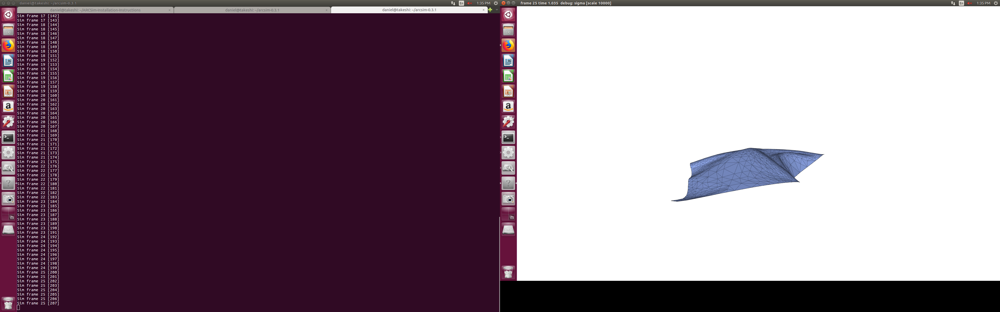

# ARCSim-Installation-Instructions

You can find ARCSim here: http://graphics.berkeley.edu/resources/ARCSim/

Right now I'm using **version 0.3.1**, even though we don't need fractures.

ARCSim is tricky to install. Here are the steps I followed. First, unzip the
`tar.gz` file somewhere and read the INSTALL file. You'll see that they tell
you to install some libraries, but it's not clear what the precise commands
should be (and there are some missing instructions). Here's what I did to get
this working on an Ubuntu 16.04 system:

- Rename `Makefile.linux` to `Makefile` if using Ubuntu/Linux, because it seems
  like OS X is the default. Of course, if you're on OS X then you're probably
  OK (but it might be good to rename `Makefile.mac` to `Makefile` anyway).

- Install the following via `sudo apt-get install`:

  ```
  sudo apt-get install gcc make g++ libboost-all-dev freeglut3-dev \
            gfortran liblapacke-dev libpng-dev libpng++-dev scons \
            libatlas-base-dev ctags libopenblas-dev
  ```

  For OS X, you'll need to figure out how to get the equivalent libraries
  installed on your own.

- Delete a directory: `rm -r dependencies/taucs/build/darwin/`.

- Change directory into `dependencies/` and run `make`. If you didn't delete
  the directory in the previous step, you'll get this error at the end of a
  LONG print out:

  ```
  -llapack -L/usr/lib64/atlas -L/usr/lib64/atlas-sse3 -lf77blas -lcblas -latlas -lgfortran -lm
  make[1]: Leaving directory '/home/daniel/arcsim-0.3.1/dependencies/taucs'
  mkdir -p include/ lib/
  cp taucs/build/*/*.h taucs/src/*.h include/
  cp: will not overwrite just-created 'include/taucs_config_build.h' with 'taucs/build/linux/taucs_config_build.h'
  Makefile:18: recipe for target 'lib/libtaucs.a' failed
  make: *** [lib/libtaucs.a] Error 1
  ```

  But anyway, running `make` works Ideally you should see this after doing
  `make` a second time:

  ```
  daniel@takeshi:~/arcsim-0.3.1/dependencies $ make
  make: Nothing to be done for 'all'.
  daniel@takeshi:~/arcsim-0.3.1/dependencies $
  ```

- Now go back into the top-level directory `arcsim-0.3.1/` and type `make.` If
  it runs without errors, that's a good sign! Immediately running `make` a
  second time gives me this:

  ```
  daniel@takeshi:~/arcsim-0.3.1 $ make
  cd src; ctags -w *.?pp
  cd src; etags *.?pp
  ```

  which seems to be harmless.


To test the installation, run

```
./bin/arcsim simulate conf/sphere.json
```

I see this so hopefully things are OK:



though the physics can seem a bit weird.


Note: after doing `make` in the `dependencies/` directory, but before doing
`make` for the `arcsim-0.3.1` directory, you might need to make the following
fixes if they are resulting in compilation errors:

- Change `<< file` to `<< std::endl` at the end of line 118 of `src/sparse.hpp`.

- Comment out lines 805 and 811 in `dependencies/include/taucs.h`, which are:

  ```
  [805] extern int isnan(double);
  [811] extern int isinf(double);
  ```

But I did not need to do those and it seems like things are working on my end.
